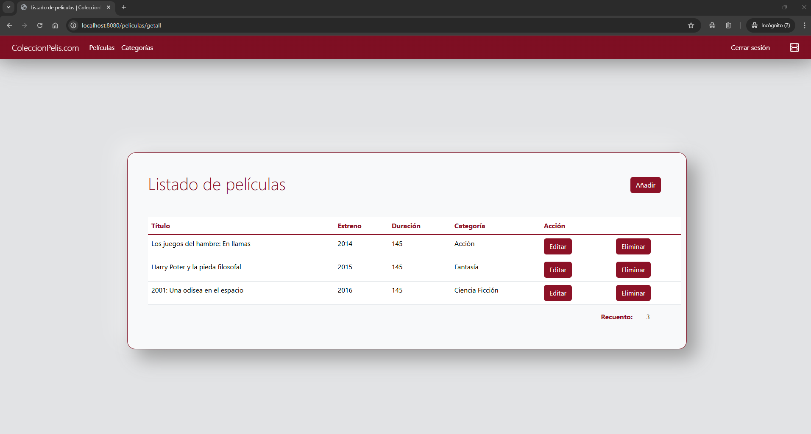

# ColeccionPelis.com

## Descripción
**ColeccionPelis.com** es una aplicación web para amantes del cine, donde los usuarios pueden registrarse para crear su propia base de datos de películas favoritas y ver información detallada sobre ellas.

---

## Instalación, Configuración y Acceso

### 1. Importar el Proyecto  
- Abre **Eclipse** o **Visual Studio Code** e **importa el proyecto**.

### 2️. Configurar Base de Datos  
- Ejecuta el script de **MySQL** para cargar los datos en la base de datos.

### 3️. Configurar `application.properties`  
- Asegúrate de establecer el usuario y la contraseña de tu instancia local de **MySQL** en `application.properties`:  

  ```properties
  spring.datasource.username=root
  spring.datasource.password=

### 4. Hacer un "clean project" (opcional)
- Para evitar errores de inaccesibilidad en templates/fragments

### 5. Login usuarios locales
- Antes de acceder a la aplicación necesitarás ingresar usuario y contraseña guardados en memoria y establecidos con **JavaSecurity**
  ```properties
  usuario=pepita
  contraseña=matrix10

### 6. Login usuarios en base de datos
- Para hacer el login de la aplicación necesitarás ingresar **usuario y contraseña guardados en base de datos** (puedes coger cualquiera de los que están guardados).
  ```properties
  usuario=La pepita
  contraseña=matrix10

---

## Funcionalidades
- Logeo de usuarios guardados en memoria con JavaSecurity.
- Logeo de usuarios guardados en base de datos:
	- Si no existe el usuario o la contraseña es incorrecta, se le avisa a través de un texto en rojo debajo de los campos.
- Guardado de sesiones para que los usuarios que no se han logeado no puedan acceder a otras páginas.
- Permitir que el usuario pueda cerrar su sesión
- Creación de peliculas.
- Creación de categorias.
- Recuperación de listado de peliculas que el usuario a añadido a su perfil
- Recuperación de listado de categorias.
- Recuperación de listado de peliculas de una categoria en concreto.
- Uso de las relaciones ManyToMany y OneToMany
- Creación de fragments y layouts para el diseño

---

## Advertencias y problemas que quedaron sin resolver
- Para que aparezca el nombre de la categoria despues de agregar una nueva pelicula, se tiene que agregar una nueva pelicula o cerrar sesión y volver a loggearse
- Cuando editas una pelicula se crea una nueva
- Al darle al botón eliminar da error
- Cuando se le da a "Ver peliculas" (en categorias.html) se ven todas las peliculas guardadas en la base de datos, faltó filtrarlas para que solo aparezcan las del usuario conectado
- Faltó que cuando seleccionas una categoria (que no tiene peliculas) y le das al botón añadir pelicula, no sale rellenado el campo de categoria

---

## Mejoras
- Cuando un usuario no se pueda autenticar, crear el Modal con Bootstrap.
- Añadir página de perfil de usuario con sus datos y darle la posibilidad de cambiar algún dato o darse de baja de la aplicación
- Ampliar Peliculas, es decir, crear una página con información de cada película (por ejemplo, que tenga sinopsis, imagenes, actores, directores, música, etc)

---

## Capturas





